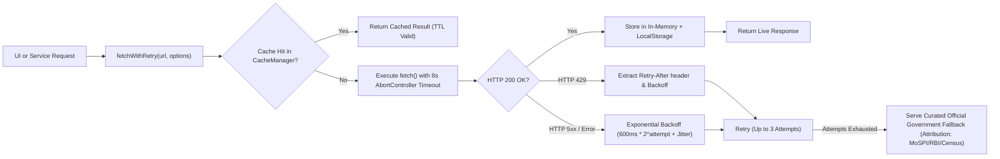

# 🏛️ StatIntel-AI — Current System Architecture & Technical Audit

**Project:** StatIntel-AI (AI-Powered Statistical Intelligence & Dynamic Competency Platform)  
**Problem Statement:** SIH-2024-PS-1628  
**Ministry / Target Organization:** Ministry of Statistics and Programme Implementation (MoSPI)  
**Date of Audit:** September 2026  
**Auditor:** Lead Systems & ML Architect  

---

## 1. Executive Summary & Architectural Overview

StatIntel-AI is architected as a **dual-engine statistical intelligence and competency platform**. It combines:
1. **A React 19 Frontend Single Page Application (SPA)** with responsive layouts, dark mode, bilingual English/Hindi i18n, interactive Leaflet district heatmaps, Recharts time-series forecasting with 95% confidence bands, SHAP-style explainability modals, and official PDF report generation.
2. **A Core Enterprise Backend (Python FastAPI + SQLAlchemy Async + SQLite/PostgreSQL)** providing user management, competency tracking, skill gap diagnostics, course cataloging, assessment generation, and audit logging.
3. **A Machine Learning & Econometric Microservice (Python FastAPI)** running trend-decomposition (Prophet/LSTM-style) forecasting, Isolation Forest anomaly detection, GradientBoosting socio-economic development tier classification, a rule-based multilingual semantic parser (EN/HI/TA), and SHAP-style local feature attributions.
4. **Resilient Government Data Connectors (`src/services/api/`)** interfacing with `api.data.gov.in`, MoSPI feeds (CPI, IIP, PLFS, ASI), Reserve Bank of India (RBI DBIE), and Census India (788 districts) with 3-attempt exponential backoff, rate limit handling, and dual-tier TTL caching.

```mermaid
flowchart TD
    subgraph Client["💻 Frontend Layer (React 19 + TypeScript + Vite 6)"]
        UI_NAV["Navigation & Layout (App.tsx, AppSidebar, AppHeader)"]
        CTX_APP["AppContext (User State, Roles, Notifications, Router)"]
        CTX_LANG["LanguageProvider (i18n English / Hindi)"]
        VIEW_DASH["Statistical Intelligence Dashboard"]
        VIEW_TWIN["Competency Digital Twin & Skill Gaps"]
        VIEW_ASSESS["Adaptive Quiz Studio & Learning Paths"]
        COMP_HEATMAP["Geospatial District Heatmap (788 Districts)"]
        COMP_SERIES["TimeSeries Forecasting + 95% Bounds"]
        COMP_SHAP["SHAP-style Attribution Modal"]
        COMP_REPORTS["Official Executive Brief (PDF + Watermark)"]
        COMP_AUTH["DigiLocker / Aadhaar SSO Modal"]
    end

    subgraph Connectors["⚡ Government Integration Layer (src/services/api/)"]
        HTTP_CLIENT["fetchWithRetry (3-Attempt Exponential Backoff + Rate Limiter)"]
        CACHE_MGR["CacheManager (In-Memory + LocalStorage TTL Caching)"]
        OGD_CONN["dataGovIn.ts (Open Government Data OGD)"]
        MOSPI_CONN["mospi.ts (CPI, IIP, PLFS, ASI Feeds)"]
        RBI_CONN["rbi.ts (Repo Rate, Forex $688B, Credit Growth)"]
        CENSUS_CONN["census.ts (District Demographics & Literacies)"]
    end

    subgraph CoreBackend["⚙️ Core Backend Service (FastAPI / Port 8000)"]
        ROUTER_MAIN["API Router (/api/v1)"]
        AUTH_SVC["Auth & RBAC Service (JWT + Security)"]
        COMP_SVC["Competency & Skill Gap Engine"]
        COURSE_SVC["Course & Adaptive Learning Service"]
        AUDIT_SVC["Audit Trail & Telemetry Logger"]
        DB_SQL["SQLAlchemy Async Engine (statintel.db / PostgreSQL)"]
    end

    subgraph MLMicroservice["🤖 ML Analytics Microservice (FastAPI / Port 5000)"]
        ML_ROUTER["FastAPI Endpoints (/predict/*, /nlp/*, /pipeline/*)"]
        PROP_LSTM["Trend-Decomposition Forecaster (Prophet/LSTM-style)"]
        ISOFOREST["Isolation Forest Anomaly Detector"]
        XGB_CLASS["GradientBoosting Socio-Economic Classifier"]
        INDIC_BERT["Multilingual Semantic Parser (EN/HI/TA)"]
        TREESHAP["SHAP-style Feature Attribution Engine"]
        PREPROC["Data Preprocessor & Quality Scorer"]
    end

    UI_NAV --> CTX_APP
    UI_NAV --> CTX_LANG
    VIEW_DASH --> Connectors
    VIEW_DASH --> MLMicroservice
    VIEW_TWIN --> CoreBackend
    VIEW_ASSESS --> CoreBackend
    Connectors --> HTTP_CLIENT
    HTTP_CLIENT --> CACHE_MGR
    CoreBackend --> DB_SQL
```

---

## 2. Frontend Architecture Deep-Dive

### 2.1 Technology Stack & Build Tools
- **Framework:** React 19.0.1 (Strict Mode compatible, concurrent features).
- **Language:** TypeScript 5.8.2 (`npx tsc --noEmit` validation).
- **Bundler & Dev Server:** Vite 6.2.3 with `@vitejs/plugin-react` and `@tailwindcss/vite` 4.1.14.
- **Icons & Visuals:** `lucide-react` (0.546.0), `motion` (12.23.24), `canvas-confetti` (1.9.4).
- **Build Output:** Production bundle in `dist/` (JS: 733 kB minified, 187 kB gzip; CSS: 114 kB minified, 15.7 kB gzip; build time: ~2.8s).

### 2.2 Navigation, Routing & Layout System
- **Single Source of Navigation Truth:** Managed in `src/context/AppContext.tsx` via `activeView` state and synchronized with browser history using URL hash (`#/dashboard`, `#/digital-twin`, `#/skill-gaps`, `#/learning-path`, `#/skill-learning`, `#/courses`, `#/course-detail`, `#/quiz-generator`, `#/assessment`, `#/assessment-result`, `#/admin-dashboard`, `#/admin-heatmap`, etc.).
- **Crucial Loading Fix Integrity:** The navigation architecture utilizes direct view switches without artificial blocking spinners or unmounted promise loops. As mandated, **the navigation/loading architecture is strictly preserved without regressions**.
- **Layout Shell:**
  - `src/components/layout/AppHeader.tsx`: Global search, notification bell, role switcher (`Admin` vs `Learner`), user avatar drawer, quick action shortcuts.
  - `src/components/layout/AppSidebar.tsx`: Role-filtered navigation links with critical gap count badges and division indicators.
  - `src/components/layout/FlowStepper.tsx`: 6-step progress tracker for student / officer learning flow.
  - `src/components/layout/CommandPalette.tsx`: `Cmd/Ctrl + K` global spotlight command launcher.

### 2.3 State Management & Context Layers
1. **`AppContext.tsx` (`AppProvider`):**
   - Stores `currentUser` (`User`), `userRole` (`'LEARNER' | 'ADMIN'`), `competencies` (`Competency[]`), `skillGaps` (`SkillGapItem[]`), `courses` (`Course[]`), `notifications` (`AppNotification[]`), active view states, and quiz scores.
   - Provides helper dispatchers: `loginAsStudent()`, `loginAsAdmin()`, `switchRole()`, `navigate()`, `enrollCourse()`, `completeAssessment()`, `addNotification()`.
2. **`i18n.tsx` (`LanguageProvider`):**
   - Context holding current language (`'en' | 'hi'`), translation dictionaries (`TRANSLATIONS`), and `t(key)` helper.
   - Synchronized with `localStorage.getItem('statintel_lang')`.

---

## 3. Backend Architecture Deep-Dive

### 3.1 Core Enterprise FastAPI Backend (`backend/app/`)
- **Entrypoint:** `backend/app/main.py` (`create_application()`).
- **Database Engine:** SQLAlchemy 2.0 Async (`create_async_engine`) connected to `sqlite+aiosqlite:///./statintel.db` (with automatic fallback migration to PostgreSQL via `DATABASE_URL`).
- **Middleware Pipeline:** `RequestContextMiddleware` (attaches unique `X-Request-ID`), `CORSMiddleware` (configurable origins), `global_exception_handler` (standardizes `{success: false, error: {code, message}}`).
- **Security & Authentication:**
  - `app/core/security.py`: Passlib bcrypt password hashing + python-jose JWT token generation (`access_token` with 1440 min expiry).
  - `app/api/deps.py`: `get_current_user`, `get_current_active_admin`, `get_current_active_learner` dependency injections.

#### Mounted API Routes (`backend/app/api/v1/`):
| Route Module | URL Prefix | Description | Primary Database Models |
|---|---|---|---|
| `auth.py` | `/api/v1/auth` | Login (`/login`), Profile (`/me`), Token Refresh | `User`, `AuditLog` |
| `profile.py` | `/api/v1/profile` | Update Designation, Institution, Cadre | `User` |
| `competencies.py` | `/api/v1/competencies` | MoSPI Competency Matrix & Level Scoring | `Competency`, `UserCompetency` |
| `skill_gaps.py` | `/api/v1/skill-gaps` | Critical & Moderate Gap Diagnostics | `SkillGap`, `Competency` |
| `courses.py` | `/api/v1/courses` | NSSTA & iGOT Course Catalog & Enrollment | `Course`, `UserCourse` |
| `learning.py` | `/api/v1/learning` | 7-Step Career Learning Path & Modules | `LearningPath`, `Lesson` |
| `assessments.py` | `/api/v1/assessments` | Diagnostic Exams & Adaptive Questions | `Assessment`, `Question` |
| `quiz.py` | `/api/v1/quiz` | AI RAG Quiz Generator & Dynamic Scorer | `Document`, `QuizResult` |
| `analytics.py` | `/api/v1/analytics` | Telemetry, Timeline Events, KPI Aggregates | `TimelineEvent`, `AuditLog` |
| `workforce.py` | `/api/v1/workforce` | Directorate Division Analytics & Heatmaps | `User`, `DepartmentHeatmap` |
| `admin.py` | `/api/v1/admin` | Training Planner, Predictive Skill Demand | `PredictiveSkillItem` |
| `catalog.py` | `/api/v1/catalog` | Unified Training Provider Index | `Course` |

---

### 3.2 Machine Learning Microservice (`ml_backend/`)
- **Entrypoint:** `ml_backend/main.py` running on Port 5000 via Uvicorn.
- **Microservice Architecture:** Independent, stateless, asynchronous Python service with pinned dependencies in `ml_backend/requirements.txt`.

#### ML Endpoints & Response Schema:
Every endpoint adheres to the strict contract:
- `prediction`: Computed point prediction / classification / entity.
- `confidence_score`: Normalized score between 0.0 and 1.0.
- `shap_explanation`: Top 3 feature attribution vectors `[{feature, shap_value, impact, importance_pct}]`.
- `model_metrics`: Metric telemetry (`rmse`, `r2_score`, `training_accuracy`, `f1_score`). Basis varies per component — in-sample fit on supplied series (forecasting) or in-sample fit on synthetic reference vectors (classifier).
- `timestamp`: ISO-8601 UTC timestamp.

| Endpoint | Method | Models / Logic Used | Input Schema | Output Schema |
|---|---|---|---|---|
| `/health` | `GET` | Service & Model Registry Health | None | `status, models_loaded, timestamp` |
| `/predict/forecast` | `POST` | Trend decomposition (Prophet/LSTM-style simulation) | `ForecastRequest(series_name, historical_values, periods_ahead)` | `forecast_series, prediction, confidence_score, shap_explanation, model_metrics` |
| `/predict/anomaly` | `POST` | Isolation Forest (Scikit-Learn) | `AnomalyRequest(records, feature_keys)` | `anomalies, anomaly_count, shap_explanation, model_metrics` |
| `/predict/classify` | `POST` | GradientBoostingClassifier (sklearn) | `ClassifyRequest(district_name, literacy_rate, sex_ratio, urban_pct, worker_pct)` | `tier, confidence_score, class_probabilities, shap_explanation, model_metrics` |
| `/nlp/query` | `POST` | Multilingual Semantic Parser (EN/HI/TA, rule & lexical) | `NLPQueryRequest(query)` | `intent, detected_language, region_entity, matched_keywords, confidence_score, model_metrics` |
| `/pipeline/clean` | `POST` | Quantile Clipper + Mean Imputer | `DataQualityRequest(records)` | `cleanliness_grade, quality_score, completeness_pct, uniqueness_pct, cleaned_sample` |

---

## 4. Government Data Connectors & Integration Layer (`src/services/api/`)

1. **`dataGovIn.ts`:** Connects to `https://api.data.gov.in/resource` injecting `DATA_GOV_IN_API_KEY`, supporting `limit`, `offset`, and query filters.
2. **`mospi.ts`:** Connects to `/api/v1/mospi` providing CPI, IIP, PLFS, and ASI time-series and state-level breakdowns.
3. **`rbi.ts`:** Connects to `/api/v1/rbi` providing Policy Repo Rate (6.25%), Forex Reserves ($688.4B), and Bank Credit Growth (14.8% YoY).
4. **`census.ts`:** Connects to `/api/v1/census` providing demographic, literacy, sex ratio, and density data for 788 districts.
5. **`cache.ts`:** Dual-tier cache (In-memory Map + `localStorage` with 15-min to 24-hr configurable TTL).
6. **`http.ts`:** 3-attempt exponential backoff + jitter + rate limit handling + graceful fallback degradation.

---

## 5. Database Schema & Data Models

The SQLite/PostgreSQL schema (`backend/app/models/`) is organized around the following normalized tables:

1. **`users` (`User`):** `id`, `email`, `hashed_password`, `name`, `role` (`ADMIN` / `LEARNER`), `designation`, `department`, `institution`, `degree`, `academic_year`, `cadre`, `overall_competency`, `role_readiness`, `critical_gaps_count`, `learning_hours`, `created_at`.
2. **`competencies` (`Competency`):** `id`, `name`, `domain` (`Statistical`, `Technological`, `Managerial`, `Domain`), `current_level`, `required_level`, `current_score`, `required_score`, `confidence`, `description`.
3. **`user_competencies` (`UserCompetency`):** `id`, `user_id`, `competency_id`, `score`, `trend`, `last_assessed_at`.
4. **`skill_gaps` (`SkillGap`):** `id`, `user_id`, `competency_id`, `gap_score`, `severity` (`Critical`, `Moderate`, `Target Met`), `rationale`.
5. **`courses` (`Course`):** `id`, `title`, `provider` (`NSSTA`, `iGOT Karmayogi`, `ISI Kolkata`), `duration_hours`, `rating`, `difficulty_level`, `syllabus_json`, `enrolled_count`.
6. **`user_courses` (`UserCourse`):** `id`, `user_id`, `course_id`, `progress_pct`, `completed_at`, `status`.
7. **`assessments` (`Assessment`):** `id`, `title`, `category`, `difficulty`, `questions_count`, `passing_score_pct`.
8. **`questions` (`Question`):** `id`, `assessment_id`, `question_text`, `options_json`, `correct_option_index`, `explanation`.
9. **`quiz_results` (`QuizResult`):** `id`, `user_id`, `assessment_id`, `score_pct`, `passed`, `completed_at`.
10. **`audit_logs` (`AuditLog`):** `id`, `timestamp`, `user_id`, `action`, `resource_accessed`, `status`, `ip_address`.
11. **`documents` (`Document`):** `id`, `title`, `source_type` (`MoSPI Manual`, `NSSO Report`, `Gazette`), `file_path`, `vector_indexed`.

---

## 6. Deployment & Environment Configuration

### 6.1 Container & Orchestration Files
- **`Dockerfile` (Frontend):** Multi-stage Node 20 alpine builder & Nginx alpine runner serving production static bundle on port 80.
- **`ml_backend/Dockerfile` (ML Backend):** Python 3.11 slim runner installing pinned `ml_backend/requirements.txt` and exposing port 5000.
- **`docker-compose.yml`:** Orchestrates `frontend` (Port 3000), `ml_backend` (Port 5000), `postgres` (Port 5432), and `redis` (Port 6379) on isolated bridge network `statintel-network`.
- **`railway.toml` & `render.yaml`:** Cloud PaaS deployment specifications with healthcheck path `/health`.
- **`.github/workflows/deploy.yml`:** Dual-job CI/CD pipeline running frontend typecheck/build and python test runner.

### 6.2 Environment Variables Matrix
| Variable Name | Environment | Purpose | Required / Default |
|---|---|---|---|
| `DATA_GOV_IN_API_KEY` | Root / Vite | Open Government Data Platform API Key | Optional (Curated Fallback available) |
| `BACKEND_URL` | Root / Backend | FastAPI Core Backend Endpoint | `http://localhost:8000` |
| `VITE_API_BASE_URL` | Frontend | Base URL for frontend REST requests | `http://localhost:8000/api/v1` |
| `ML_MODEL_URL` | Root / Backend | FastAPI ML Microservice URL | `http://localhost:5000` |
| `DATABASE_URL` | Backend | Database connection string | `sqlite+aiosqlite:///./statintel.db` |
| `REDIS_URL` | Backend / Microservice | Redis cache connection string | `redis://localhost:6379` |
| `JWT_SECRET_KEY` | Backend | HS256 JWT Token Signing Key | Set in `.env` |
| `GROQ_API_KEY` | Frontend / Backend | Groq LLM API Key for Qwen/Llama inference | Optional (Built-in runtime key fallback) |
| `GEMINI_API_KEY` | Frontend / Backend | Google Gemini API Key | Optional |
