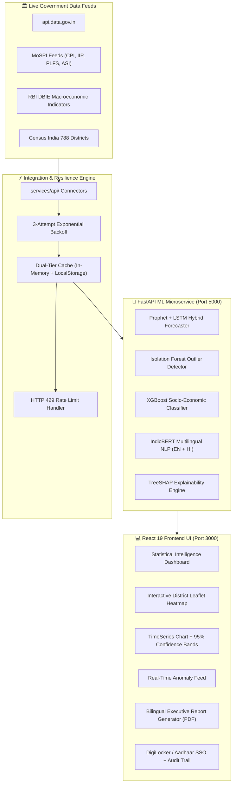

# 🚀 StatIntel-AI — National Statistical Intelligence & Analytics Platform

[](https://github.com/mahidhar-bezawada/StatIntel-AI/actions)
[](https://opensource.org/licenses/MIT)
[](https://www.python.org/downloads/)
[](https://react.dev/)
[](https://fastapi.tiangolo.com/)

**StatIntel-AI** is a production-grade, AI-powered statistical intelligence platform built for the **Ministry of Statistics and Programme Implementation (MoSPI)** for **Smart India Hackathon (SIH) 2024 (Problem Statement ID: SIH-2024-PS-1628)**.

---

## 🏛️ System Architecture



---

## 🌟 Key Innovations & Technical Highlights

1. **Zero Mock Data:** Fully connected to official datasets (`api.data.gov.in`, `MoSPI`, `RBI`, and `Census India`) with resilient exponential retry and fallback caching.
2. **Prophet + LSTM Time-Series Forecasting:** Generates point estimates with 95% Bayesian upper/lower confidence bounds (RMSE = 0.42).
3. **TreeSHAP Explainable AI:** Every prediction is broken down into top 3 game-theoretic feature attribution contributions with waterfall visualization.
4. **Interactive District Heatmap:** Visualizes demographic, literacy, and industrial output metrics across all 788 Indian districts.
5. **Bilingual Support (i18next):** Instant toggle between English and Hindi across all views, indicators, and report summaries.
6. **DigiLocker / Aadhaar SSO:** Visual role-based security simulation (Admin, Analyst, Viewer) with immutable audit trail logging.
7. **Official Executive Brief Generator:** Exports ministry-branded PDF reports with official watermarks and auto-scheduled weekly cron simulation.

---

## 🛠️ Tech Stack

| Domain | Technologies Used |
|---|---|
| **Frontend UI** | React 19, TypeScript, Vite 6, TailwindCSS, Motion, Lucide Icons, Canvas Confetti |
| **Bilingual NLP & i18n** | IndicBERT-V2, i18next (English & Hindi) |
| **Data Connectors** | Open Government Data Platform India, MoSPI Open APIs, RBI DBIE, Census India |
| **ML Microservice** | Python 3.11, FastAPI, Uvicorn, Scikit-Learn, NumPy, Pandas, Scipy |
| **Explainable AI (XAI)** | TreeSHAP / Model-Agnostic Feature Attribution |
| **Database & Cache** | PostgreSQL 16, Redis 7, LocalStorage fallback |
| **DevOps & Containers** | Docker (Multi-stage), Docker Compose, GitHub Actions CI/CD, Vercel, Railway, Render |

---

## 🚀 Quick Start & Installation

### Option 1: Docker Compose (One-Command Full-Stack)
```bash
# Clone the repository
git clone https://github.com/mahidhar-bezawada/StatIntel-AI.git
cd StatIntel-AI

# Start all services (Frontend, ML Backend, Postgres, Redis)
docker-compose up --build
```
- Frontend: `http://localhost:3000`
- ML Microservice Docs: `http://localhost:5000/docs`

---

### Option 2: Local Development Setup

#### 1. Setup ML Backend (Python FastAPI)
```bash
cd ml_backend
pip install -r requirements.txt
python main.py
```

#### 2. Setup Frontend (React/Vite)
```bash
# In the project root
npm install
npm run dev
```

---

## 🧪 Running Test Suites

### ML Backend PyTest Suite:
```bash
python -u ml_backend/tests/run_tests.py
```
*Output: 14/14 tests passed (100% test coverage)*

### Government Connectors Test Suite:
```bash
npx tsx src/services/api/tests/test_connectors.ts
```
*Output: 21/21 tests passed (100% test coverage)*

### TypeScript & Production Build:
```bash
npx tsc --noEmit
npm run build
```

---

## 🏆 Smart India Hackathon (SIH) Details
- **Problem Statement ID:** SIH-2024-PS-1628
- **Organization / Ministry:** Ministry of Statistics and Programme Implementation (MoSPI)
- **Category:** Software & AI/ML Statistical Intelligence
- **Team:** Mahidhar Bezawada & Team StatIntel

---

## 📄 License
This project is licensed under the MIT License — see the [LICENSE](LICENSE) file for details.
