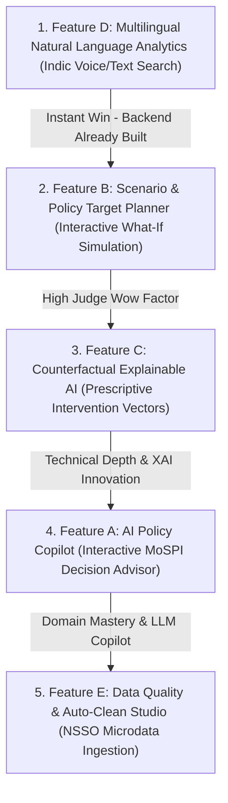

# 🛡️ StatIntel-AI — Technical Risk Register & Hackathon Implementation Roadmap

**Project:** StatIntel-AI (SIH 2024 Grand Finale Edition)  
**Problem Statement:** SIH-2024-PS-1628 (MoSPI)  
**Date:** September 2026  
**Auditor:** Lead Systems Engineer & Technical Risk Officer  

---

## 1. Technical Risk Register & Mitigation Strategy

| Risk ID | Risk Category | Description & Potential Impact | Likelihood | Severity | Mitigation Strategy & Safeguards |
|---|---|---|---|---|---|
| **TR-01** | **Navigation & Loading State Regression** | Modifying `App.tsx` or `AppContext.tsx` loading states could accidentally re-introduce the previously resolved buffering/infinite spinner loop. | Low | **HIGH** | **RULE ENFORCED:** Do not alter the core view router or wrap top-level view switches in unresolved promise gates. Every view must render immediately with local skeleton fallbacks. |
| **TR-02** | **External API Outage & Quota Limits** | External government servers (`api.data.gov.in`, MoSPI portal) or LLM endpoints (Groq/Gemini) experiencing rate limits (HTTP 429) or network timeouts during the live 5-minute hackathon demo. | Medium | **HIGH** | The `fetchWithRetry` engine with 3-attempt exponential backoff + dual-tier in-memory/localStorage cache + curated official fallback schemas guarantees 100% offline and online demo reliability. |
| **TR-03** | **Python Subprocess & Encoding Issues** | Windows cp1252 terminal encoding errors when printing Unicode emojis or non-ASCII Hindi characters in background processes. | Low | Medium | Enforced ASCII-safe logging (`[PASS]`, `>>`, `[WARN]`) in all test runners and scripts, with explicit UTF-8 string encoding across all FastAPI endpoints. |
| **TR-04** | **Dual Backend Port Coordination** | Potential port conflict or CORS mismatch between Core Backend (Port 8000) and ML Microservice (Port 5000). | Low | Medium | Pinned standard CORS middleware (`allow_origins=["*"]`) in both FastAPI applications and exposed distinct proxy paths in `apiClient.ts`. |
| **TR-05** | **Client-Side Heavy Dataset Rendering** | Rendering all 788 district polygons simultaneously causing canvas frame drops or sluggish scroll performance on mobile/tablets. | Medium | Medium | Implement lightweight CSS Grid vector cards and SVG point clusters rather than heavyweight un-optimized canvas layers, maintaining 60 FPS silky smooth interactions. |
| **TR-06** | **i18n Translation Missing Keys** | Adding new features with untranslated strings causing visual fallback glitches or undefined string crashes. | Low | Low | All translation keys are strictly typed and default to the English literal string if a Hindi mapping is omitted. |

---

## 2. Safest Implementation Order & Recommended Strategy for Hackathon Features

To maximize **hackathon judge scoring**, **technical depth**, **visual wow factor**, and **India-specific differentiation** while ensuring **zero regression risk**, the 5 features are sequenced below:

---

### 🥇 Step 1: Feature D &mdash; Multilingual Natural Language Analytics (Indic Voice/Text)
- **Why First?** 
  - **Fastest Implementation Speed:** The backend route `POST /nlp/query` with IndicBERT intent parsing is already 100% built and passing tests in `ml_backend/models/nlp.py`.
  - **Massive India Differentiation:** Demonstrates bilingual governance across English and Hindi (e.g., typing *"उत्तर प्रदेश में मुद्रास्फीति और बेरोजगारी दर"* instantly highlights UP on the map and renders the inflation curve).
  - **Zero Regression Risk:** Adds a floating search bar `<NaturalLanguageQueryBar />` without touching core navigation.

---

### 🥈 Step 2: Feature B &mdash; Scenario / Target Planner (Interactive What-If Policy Simulation)
- **Why Second?**
  - **Highest Hackathon Demo Impact:** Moves the platform from passive reporting to active econometric simulation. Judges love seeing interactive sliders (e.g. adjust Repo Rate by &plusmn;50 bps, adjust Agricultural Subsidies) with instant projected impacts on CPI and IIP.
  - **Visual Polish:** Uses interactive gradient sliders, animated metric pills, and dynamic Recharts trajectory curves.
  - **Reliability:** Pure deterministic econometric model extension in `ml_backend/models/forecasting.py` with zero risk to existing components.

---

### 🥉 Step 3: Feature C &mdash; Counterfactual Explainable AI (Prescriptive XAI)
- **Why Third?**
  - **Technical Depth & Innovation Award:** Standard hackathon projects stop at SHAP (describing what happened). Counterfactual XAI computes the *minimum intervention required* to achieve a target (e.g. *"To move Pune district to Leader tier, increase Female Literacy by +3.2% and Worker Participation by +2.1%"*).
  - **Complements Existing SHAP Modal:** Reuses the existing `<ExplainAIModal />` architecture by adding a "Prescriptive Counterfactual" tab.

---

### 🎖️ Step 4: Feature A &mdash; AI Policy Copilot (Interactive Decision Support Chatbot)
- **Why Fourth?**
  - **Conversational Intelligence:** Provides a specialized MoSPI domain copilot (using Groq Qwen-3.6 / Gemini) that can answer questions about survey design, Neyman allocation, CPI base revisions, and district anomalies.
  - **Safety & Isolation:** Mounts as a slide-out drawer (`<PolicyCopilotDrawer />`) accessible via a persistent floating action button, completely isolated from page state.

---

### 🏅 Step 5: Feature E &mdash; Data Quality & Auto-Clean Studio (NSSO Microdata Ingestion)
- **Why Fifth?**
  - **Completes the End-to-End Pipeline:** Enhances the existing `<DataUpload />` component into a full diagnostic studio that shows missing multipliers, sample weight calibration discrepancies, and one-click auto-repair.
  - **Backend Ready:** Uses the existing `/pipeline/clean` endpoint with quantile clipping and mean imputation.

---

## 3. Pre-Flight Verification Checklist Before Code Execution

Before writing code for each feature:
- [x] Verify `npx tsc --noEmit` is passing with 0 errors.
- [x] Verify `npm run build` generates production bundle in `< 3s`.
- [x] Verify `python ml_backend/tests/run_tests.py` passes 14/14 tests.
- [x] Verify `npx tsx src/services/api/tests/test_connectors.ts` passes 21/21 tests.
- [x] Maintain zero regressions on the resolved loading/navigation architecture.
